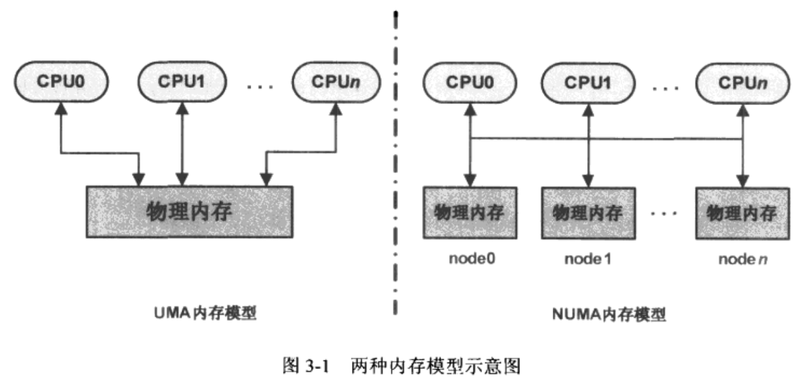
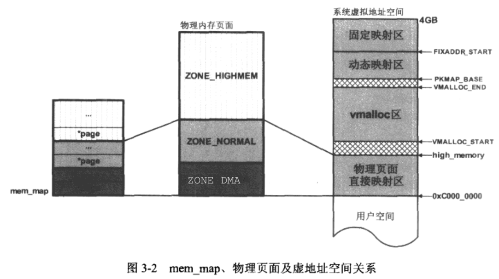
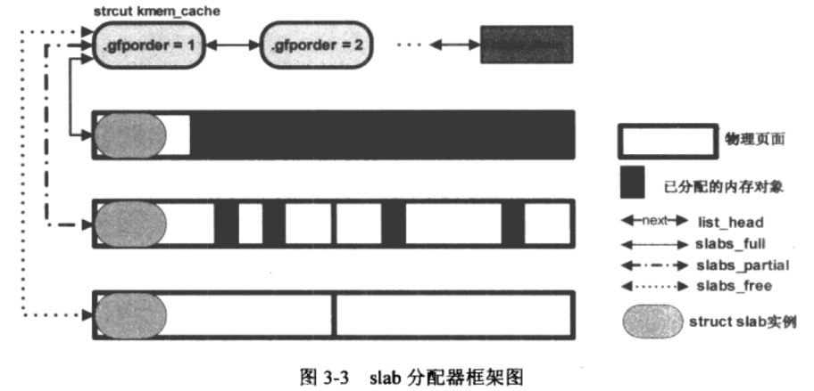
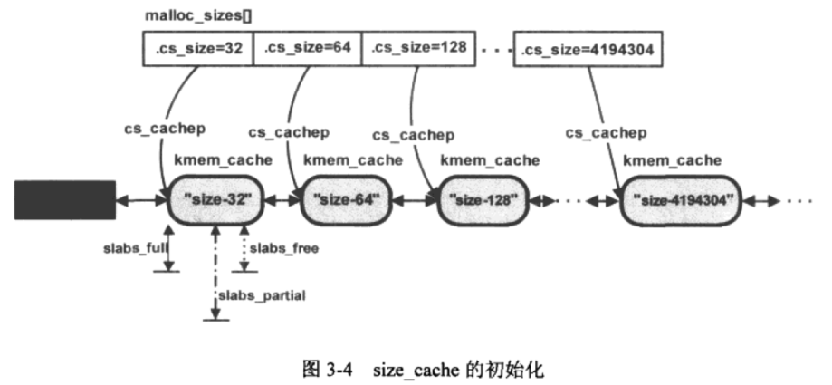
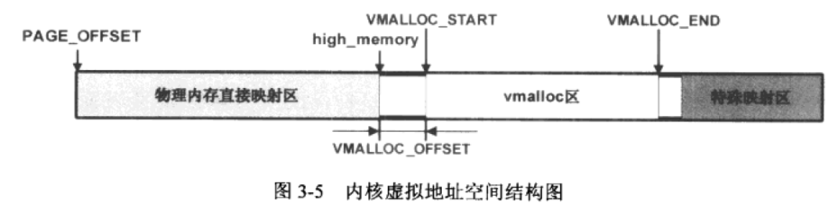
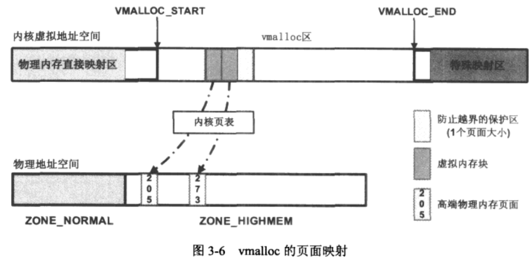

## 第一章 内核模块

#### 目的

- 模块的加载过程
- 模块如何引入用内核或者其他模块中的函数与变量
- 模块本身导出的函数与变量如何被别的内核模块使用
- 模块的参数传递机制
- 模块之间的依赖关系
- 模块中的版本控制机制

#### 1.1内核模块文件格式

内核模块是一种普通的可重定位目标文件。ELF(Executable and Linkable Format)格式


#### 1.2 EXPORT_SYMBOL的内核实现

​	对于静态编译链接而成的内核映像而言，所有的符号引用都将在静态链接阶段完成。

​	作为独立编译链接的内核模块，要解决这种静态链接无法完成的符号引用问题（在模块elf文件中，这种引用称为“未解决的引用”） 

​	处理"未解决引用"问题的本质是在模块加载期间找到当前“未解决的引用”符号在内存中的实际目标地址。

​	内核和内核模块通过符号表的形式向外部世界导出符号的相关信息。方式：EXPORT_SYMBOL,经三部分达成：EXPORT_SYMBOL宏定义部分，链接脚本连接器部分和使用到处符号部分。

​	在链接脚本告诉链接器把目标文件中名为`__ksymtab` 和`__ksymtab_strings`的section放置在最终内核（或内核模块）映像文件的名为 `__ksymtab`和`__ksymtab_strings`的section中， 然后用EXPORT_SYMBOL 来导处符号，实际上是要通过 struct kernel_symbol的一个对象告诉外部世界关于这个符号的符号名称(`__ksymtab_strings`中)和地址(`__ksymtab`中)，这个地址会在模块加载过程中由模块加载器负责修改该成员以反映出符号在内存中最终的目标地址，这个过程也就是"重定位"过程.

#### 1.3 模块的加载过程

##### 1.3.2 struct module

load_module返回值时struct module。是内核用来管理系统中加载模块时使用的，一个struct module对象代表着现实中一个内核模块在linux系统中的抽象。

重要成员：

```c
struct module{
    ...
    enum module_state; /*记录模块加载过程中不同阶段的状态*/
    struct list_head list;/*用来将模块链接到系统维护的内核模块链表中*/
    char name[MODULE_NAME_LEN];/*模块名称*/
    const struct kernel_symbol *syms;/*内核模块导出的符号所在起始地址*/
    const unsigned long *crcs;/*内核模块导出符号的校验码所在起始地址*/
    struct kernel_param *kp;/*内核模块参数所在的起始地址*/
    ini (*init)(void);/*指向内核模块初始化函数的指针，在内核模块源码中由module_init宏指定*/
    struct list_head source_list;
    struct list_head target_list; /*用来再内核模块间建立依赖关系*/
    ...
};
```

##### 1.3.3 load_module

- 模块ELF静态的内存视图

  

  - 字符串表（string table）

    在驱动模块所在ELF文件中，有两个字符串表section，一个用来保存各section名称的字符串，另一个用来保存符号表中每个符号名称的字符串。

    section名称字符串表的基地址：char *secstrings=(char *)hdr+entry[hdr->e_shstrndx]​.sh_offset. 其中e_shstrndx是段名称字符串表在段首部表中的索引. 想获得某一section的名称，通过索引i可得地址secstrings+entry[i].sh_name.

    符号名称字符串表的基地址：char *strtab=(char *)hdr+entry[entry[i].sh_link].sh_offset. 即首先遍历Section header table中所有的entry，找一个entry[i].sh_type=SHT_SYMTAB的entry，SHT_SYMTAB表明这个entry所对应的section是一符号表。这种情况下，entry[i].sh_link是符号名称字符串表section在Section header table中的索引值。

  - HDR视图的第一次改写

    获取到section名称字符串表基地址secstrings和符号名称字符串表基地址strtab后，函数开始遍历part3的所有entry，将sh_addr改为entry[i].sh_addr= (size_t)hdr+entry[i].offset。

  - find_sec函数

    寻找某一section在Section header table中的索引值

    static unsigned int find_sec(Elf_Ehdr *hdr, Elf_Shdr *sechdrs, const char *secstrings, const char *name);

    遍历Section header table中的entry,通过secstrings找到对应的section名称和name比较,相等后返回对应索引值。

    HDR视图第一次改后，然后查找此三个section(".gun,linkonce.this_module","__versions",".modinfo")对应的索引值赋给modindex,versindex,infoindex

  - struct module类型变量 mod初始化

    模块的构造工具为我们安插了一个".gun,linkonce.this_module" section，并初始化了其中一些成员如.init(即init_module别名(initfn)(即module_init(initfn)中的initfn),和.exit。在模块加载过程中load_module函数利用这个section中的数据来初始mod变量。次section在内存中的地址即为：mod=(void *)sechdrs[modindex].sh_addr。

  - HDR视图的第二次改写

    哪些section需要移动？移动到什么位置？layout_sections负责

    有标记SHF_ALLOC的section(分两大类CORE和INIT)

    - CORE section

    遍历Section header table，section name不是".init"开始的section划为CORE section。改对应entry的sh_sh_entsize,用来记录当前section在CORE section中的偏移量。

    entry[i].sh_entsize=mod->core_size;

    > sh_entsize:
    > 有些节的内容是一张表,其中每一个表项的大小是固定的,比如符号表;对于这种表来说,该字段指明这种表中的每一个表项的大小;如果该字段的值为0,则表示该节的内容不是这种表格;

    mod->core_size+=entry[i].sh_size;//记录当前正在操作的section为止，CORE section的空间大小

    code section用 module结构中的core_text_size来记录

    - INIT section

    section name 必须以".init"开始，内核用struct module结构中的init_size来记录当前INIT section空间大小

    mod->init_size+=entry[i].sh_size;

    code section 用module的init_text_size来记录

    

    CONFIG_KALLSYMS启用后会在内核模块中保留所有符号，在ELF符号表section中，由于没有SHF_ALLOC标志，layout_sections不会移动符号表section,所以用layout_symtab将其移动到CORE section中。

    之后内核用vmalloc为CORE section和INIT section分配对应内存空间，基地址分别在mod->module_core和mod->module_init中。接着就搬移CORE和INIT section到最终位置。之后更新其中各section对应table中entry的sh_addr.

    ".gun.linkonce.this_module" section带有SHF_ALLOC标志，也移到CORE section,所以要更新

    mod=(void *)entry[modindex].sh_addr;

    为什么要移动？

    模块加载过程结束时，系统会释放掉HDR视图所在的内存区域，模块初始化工作完成后，INIT section所在内存区域也会被释放，所以最终只会留下CORE section中的内容到整个模块存活期。

    

  - 模块导出符号

    内核模块会把导出符号放到_ksymtab、_ksymtab_gpl和_ksymtab_gpl_future section中。

    这些section都带SHF_ALLOC标志，在模块加载过程中会被搬移到CORE section区域去，

    在搬移CORE section和INIT section后，内核通过HDR视图中Section header table查找获取，keymtab,ksymtab_gpl和ksymtab_gpl_future section在CORE section中的地址，分别记录到mod->syms,mod->gpl_syms和mod->gpl_future_syms中，内核即刻通过这些变量得到模块导出的符号的所有信息。
    

  - find_symbol函数

    用来查找一个符号

    struct symsearch用来对应要查找的每一个符号表section. enum型成员licence，NOT_GPL_ONLY由EXPORT_SYMBOL导出，GPL_ONLY由EXPORT_SYMBOL_GPL导出，WILL_BE_GPL_ONLY由EXPORT_SYMBOL_GPL_FUTURE导出。

    struct find_symbol_arg用做查找符号的标识参数，成员kernel_symbol是一个用以表示内核符号构成的数据结构。

    find_symbol函数首先构造被查找模块的标志参数fsa，然后通过each_symbol来查找符号。分两部分：第一部分：在内核导出的符号表中查找对应的符号，未找到，再进行第二部分：在系统中已加载模块(在全局变量modules的链表上)的导出符号中查找对应的符号。

    第一部分：在内核导出的符号表中查。查找时先构造 struct symsearch类型的数组arr。然后调用each_symbol_in_section查询内核的导出符号表，即遍历arr数组定义的各section，然后在每个section中依次通过find_symbol_in_section查找每个内核符号结构(kernel_symbol)

    find_symbol_in_section函数首先比较kernel_symbol结构体中的name与fsa中的name(正在查找的符号名，即要加载的内核模块中出现的"未解决的引用"的符号).不匹配返回false。fsa->gplok=true表明这是个GPL module,否则就是non-GPL module,对于后者，他不能使用内核导出的属于GPL_ONLY的那些符号，会直接返回查找失败。

    第二部分：在已加载模块导出的符号表中查。加载一个内核模块时需完成两点，第一，模块成功加载进系统之后，需将该模块的struc module类型变量mod加入到modules全局链表中去，记录所有已加载模块。第二，模块导出的符号信息记录在mod相关成员变量中。

    each_symbol用来再已加载模块导出的符号中查找指定符号。与在内核导出的符号表中查找符号的唯一区别在于 构造的arr数组：在全局链表modules中遍历所有已加载的内核模块，对其中每一模块用其导出符号表构造一个新的arr数组，然后查找特点符号。

  - 对"未解决的引用"符号的处理

    所谓"未解决的引用"符号，就是模块的编译工具链在对模块进行链接生成最终的.ko文件时，对于模块中调用的一些函数，如printk，无法在该模块的所有目标文件中找到这个函数的具体指令码。所以就将这个符号标记为"未解决的引用"。在内核模块被加载时，就是通过在内核或者其他模块导出的符号中找到这个"为解决就的引用"符号，从而找到该符号在内存中的地址，最终形成正确的函数调用。

    simplify_symbols函数实现此功能，用来为当前正在加载的模块中所有"未解决的引用"符号产生正确的目标地址。函数首先通过一个for循环遍历符号表中的所有符号，对于每个符号都会更具符号的st_shndx值分情况处理，通常情况下，该值表示符号所在section的索引值，称一般符号，它的st_value在ELF文件中的值时从section起始处算起的一个偏移。先得到符号所在section的最终内存地址，再加上它在section中的偏移量，就得到了符号最终内存地址。有些符号的st_shndx有特殊含义，SHN_ABS表明符号具有绝对地址，无需处理，SHN_UNDEF表明该符号是"undefined symbol即"未解决的引用",此时会调用resolve_symbol函数继而调用find_symbol函数去查找该符号，找到后把它在内存中的实际地址赋值给st_value。

  - 重定位
    重定位主要用来解决静态链接时的符号引用与动态加载时的实际符号地址不一致的问题。

    如果模块有EXPORT_SYMBOL导出的符号，那么模块的编译工具链会为这个模块的ELF文件生成一个独立的特殊section: ".rel__ksymtab",它专门用于对"__ksymtab" section的重定位，称为relocation section。

    重定位的section，在Section header table中的entry的sh_type值为SHT_REL或SHT_RELA.
    遍历Section header table的entry时发现sh_type=SHT_REL的section，就调用apply_relocate执行重定位，根据重定位元素的r_offset以及entry中的sh_info得到需要修改的导出符号struct kernel_symbol中的value所在的内存地址。然后根据r_info获得需要重定位的符号在符号表中的偏移量。也就是说 根据导出符号所在的section的relocation section，结合导出符号表section，修改导出符号的地址为在内存中最终的地址值，如此，内核模块导出符号的地址在系统执行重定位之后被更新为正确的值。

  - 模块参数

    内核模块在源码中必须用module_param宏声明模块可以接受的参数。

    ```c
    ...
    int dolpin;
    int bobcat;
    module_param(dolpin,int,0);
    module_param(bobcat,int,0);
    ...
    ```

    内核模块加载器对模块参数的初始化过程在模块初始化函数的调用之前。

    存在模块的"__param" section中，对应一个人relocation section".rel__param"，用来重定位。

    

    在把命令行参数值复制到模块的参数这个过程中,module_param宏定义的"__param"section起了桥梁作用，通过"__param" section内核可以找到模块中定义的参数所在的内存地址，继而可以用命令行的值改写之。

  - 模块间的依赖关系

    当一个模块引用到另一个模块中导出的符号时，这两个模块间就建立了依赖关系，只存在于模块之间，模块与内核间不构成依赖关系。

    依赖关系的建立发生在当前模块对象mod被加载时，模块加载函数调用resolve_symbol函数来解决"未解决的引用"符号，如果成功的找到了指定的符号，就将那个模块记录在struct module *owner中，再调用ref_module(mod,owner)在mod和owner间建立依赖关系。

    

  - 模块的版本控制

    编译内核模块时，启用了CONFIG_MODEVERSIONS,则模块最终的ELF文件中会生成一个"__versions" section，会将模块中所有“未解决的引用”符号名和对应的校验码放入其间。

    接口验证时机是在resolve_symbol函数里调用check_version函数完成，遍历“__versions” section对每个struct modversion_info元素和找到的符号名symname进行批评，成功，再进行校验码比较，相同则表明接口一致

  - 模块的license

    在模块源码中以MODULE_LICENSE宏引出

    内核模块加载过程中，会调用license_is_gpl_compatible来确定license是否与GPL兼容。

##### 1.3.4 sys_init_module （第二部分）

  - 调用模块的初始化函数

    内核模块可以不提供模块初始化函数，如果提供了，将在do_one_initcall函数内部被调用。

  - 释放INIT section所占用的空间

    模块别加载成功，HDR视图和INIT section所占用的内存区域将不再会被用到，释放它，HDR视图释放实际上发生在load module函数的最后

- 呼叫模块通知链

  通知链（notifier call chain）module_notiy_list，通过通知链模块或者其他的内核组件可以向其感兴趣的一些内核时间进行注册，当该事件发生时，这些模块或组件注册的回调函数将会被调用。

#### 模块的卸载

​	rmmod通过系统调用sys_delete_module来完成卸载工作

- find_module函数

  sys_delete_module函数首先将来自用户工具欲卸载模块名用strncpy_from_user复制到内核空间，然后调用find_module在内核维护的模块链表modules中利用name来找要卸载的模块。

-  检查模块依赖关系

  检查是否有别的模块依赖于当前要卸载的模块，检查模块的source_list链表是否为空，判断依赖关系

- find_module函数

  sys_delete_module函数最后会调用free_module函数做清理工作，将卸载模块从modules链表中移除，将模块占用的CORE section空间释放，释放冲用户空间接受参数所占用的空间。


## 第二章 字符设备驱动程序

- linux系统设备驱动分三大类：字符设备、块设备、网路设备

- 字符设备在I/O传输过程中以字符为单位，传输速率慢（无缓存机制），如鼠标键盘打印机。

  

#### 目标
1. 构成字符设备驱动程序的内核设施的幕后机制。
2. 应用程序如何使用字符设备驱动程序提供的服务。

#### 2.1 应用程序与设备驱动程序互动实例

1. 编写编译字符设备驱动模块
   1. cdev_init(&chr_dev,&chr_ops);//初始化字符设备对象，和file_operations挂钩
   2. alloc_chrdev_region(&ndev,0,1,"chr_dev");//分配设备号
   3. cdev_add(&chr_dev,ndev,1);//将字符设备对象chr_dev注册进系统。
2. insmod加载内核模块到系统
3. mknod创建设备文件节点
4. 应用程序通过读写设备文件节点来调用设备驱动程序提供的服务。

#### 2.2 struct file_operations

- struct file_operations的成员变量几乎全是函数指针。

- owner成员，表示当前file_operations对象所属的内核模块,基本都赋值THIS_MODULE.

  #define THIS_MODULE （&__this_module）,__this_nodule是内核模块的编译工具链为当前模块产生的struct module类型对象，所以THIS_MODULE实际上是当前内核模块对象的指针。owner可以避免file_operations种的函数正在被调用时，其所属的模块从系统中卸载掉。

#### 2.3 字符设备的内核抽象

- 字符设备struct cdev

  ```c
  <include/linux/cdev.h>
  struct cdev {
      struct kobject kobj;//内嵌的内核对象
      struct module *owner;//字符设备驱动程序所在的内核模块对象指针
      const struct file_operations *ops;//应用程序通过文件系统接口呼叫到字符设备驱动程序种实现的文件操作类函数的过程种，ops指针起着桥梁纽带作用。
      struct list_head list;//用来将系统中的字符设备形成链表。
      dev_t dev;//字符设备的设备号，由主设备号和次设备号构成。
      unsigned int count;//隶属于同一主设备号的次设备号的个数，即当前设备驱动程序控制的实际同类设备的数量
  };
  ```

  两种方式产生struct cdev对象

  1. 静态定义

     static struct cdev chr_dev;

  2. 动态分配

     static struct cdev *p = kmalloc(sizeif(struct cdev),GFP_KERNEL);

- cdev_alloc
  专门用于动态分配struct cdev对象。分配对象，并且进行初始化。但通常cdev会作为内嵌成员出现在实际的设备数据结构中，如：

  ```c
  struct my_keypad_dev{
      int a;
      int b;
      struct cdev cdev;
  };
  ```

  此时动态分配就不能用cdev_alloc.而是：

  ​	static struct my_keypad_dev *p = kzalloc(sizeof(struct real_char_dev),GFP_KERNEL);

- cdev_init 

  初始化一个cdev对象

  ```c
  <fs/char_dev.c>
  void cdev_init(struct cdev *cdev,const struct file_operations *fops)
  {
      memset(cdev,0,sizeof *cdev);
      INIT_LIST_HEAD(&cdev->list);
      kobject_init(&cdev->kobj,&ktype_cdev_default);
      cdev->ops=fops;
  }
  ```

#### 2.4 设备号的构成与分配

  ##### 2.4.1 设备号的构成

  ​	Linux用dev_t类型变量来标识一个设备号，是一个32位的无符号整数。低20为表示次设备号，高12位表示主设备号，但不排除后续会改变，因此建议使用MAJOR、MINOR、MKDEV来操作设备号,只修改MINORBITS即可。

  ```c
  <include/linux/kdev_t.h>
  #define MAJOR(dev) ((unsigned int)((dev)>>MINORBITS))
  #define MINOR(dev) ((unsigned int)((dev) & MINORMASK))
  #define MKDEV(ma,mi) (((ma)<<MINORBITS)|(mi))
  ```

  ​	Linux内核用主设备号来定位对应的设备驱动程序，次设备号则由驱动程序使用，标识它所管理的若干同类设备。

  ##### 2.4.2 设备号的分配与管理

   - register_chardev_region函数

     int register_chrdev_region(dev_t from,unsigned count,const char *name);

     from表示一个设备号，count是连续设备编号的个数，name表示设备或驱动的名称。

     函数主要功能是将当前设备驱动程序要使用的设备号记录到chrdevs数组中。

     函数核心调用__register_chrdev_region函数

     ​	全局指针函数chrdevs,是内核用于设备号分配和管理的核心元素

     ```c
     <fs/char_dev.c>
     static struct char_device_struct{
     	struct char_device_stuct *next,
     	unsigned int major;
     	unsigned int baseminor;
     	int minorct;
     	char namep[64];
         struct cdev *cdev;
     } *chardevs[CHRDEV_MAJOR_HASH_SIZE];
     ```

     ​	函数首先分配一个struct char_device_struct类型对象cd，然后初始化，之后开始以哈希表的形式搜索chrdevs数组，获取散列关键值i=major%255,此后函数对chrdevs[i]元素管理的链表进行扫描，若chrdevs[i]上已经有了链表节点，表面之前有别的设备驱动程序使用的主设备号散列到了chrdevs[i]上。当前正在操作的设备号不与已经在使用的设备号发生冲突就可以将cd加入到chrdevs[i]领衔的链表中成为一个新的节点。

     ​	只有在主设备相同的情况下，次设备号范围和已经加入的设备号有重叠，才会冲突。

  

  - alloc_chrdev_region函数

    int alloc_chrdev_region(dev_t *dev,unsigned baseminor,unsigned count,const char *name);

    该函数由系统协助分配设备号，范围1~254

    核心调用也是__register_chrdev_region,第一个参数为0，会从chrdevs数组最后一项依次向前扫描，若某项chrdevs[i]为NULL就把该项对应索引值i作为分配的主设备号返回给驱动程序，同时生成一个char_device_struct节点，并加入到chrdevs[i]对应的哈希链表中。分配成功后通过*dev=MKDEV(cd->major,cd->baseminor)返回给函数调用者。

  - 释放设备号 void unregister_chrdev_region(dev_t from,unsigned count);

#### 2.5 字符设备注册

把一个字符设备加入到系统中使用cdev_add函数，核心功能通过kobj_map函数实现，其通过全局变量cdev_map来把设备（*p）加入到其中的哈希表中

```c
/* p为要加入系统的字符设备对象的指针
*  dev为该设备的设备号
*  count表示从次设备号开始连续的设备数量
*/ 
int cdev_add(struct cdev *p,dev_t dev,unsigned count)
{
    p-dev=dev;
    p->count=count;
    return kobj_map(cdev_map,dev,count,NULL,exaxt_match,exact_lock,p);
}
```

```c
<fs/char_dev.c>
static struct kobj_map *cdev_map; //系统启动期间由chrdev_init函数初始化

<driver/base/map.c>
struct kobj_map{
	struct probe{
		struct probe *next;
		dev_t dev;
		unsigned long range;
		struct module *owner;
		kobj_probe_t *get;
		int (*lock)(dev_t,void *);
		void *data;
	}*probes[255];
	struct mutex *lock;
}
```
kobj_map函数中哈希表的实现原理与前面注册分配设备号种的几乎完全一样，
设备驱动程序通过cdev_add把它所管理的设备对象指针嵌入到一个类型为struct probe的节点之中，然后再把该节点加入到cdev_map所实现的哈希链表中。


模块卸载函数应负责调用cdev_del(struct cdev *p)函数来将所管理的设备对象从系统中移除。  

#### 2.6 设备文件节点的生成

设备文件是沟通用户空间程序和内核空间驱动程序的桥梁。

当前的Linux内核在挂载完根文件系统之后，会在这个根文件系统的/dev目录上重新挂载一个新的文件系统devtmpfs,后者是个基于系统RAM的文件系统实现。

静态创建 mknod /dev/demodev c 2 0

​	mknod最终调用mknod函数，参数为设备文件名（“/dev/demodev”）和设备号（mkdev(30,0)）,通过系统调用sys_mknod进入内核空间。


#### 2.7 字符设备文件的打开操作

用户空间open函数原型 int open(const char *filename,int flags,mode_t mode); 返回int型的文件描述符fd

内核空间open函数原型int (*open)(struct inode *,struct file *); 驱动程序中的demodev_read,demodev_write,demodev_ioctl等函数第一个参数都是struct file *filp.

内核需要在打开设备文件时为fd和filp建立某种联系，其次是为filp与驱动程序中的fops建立关联。


```c
<include/linux/fs.h>
struct file{
	...
	const struct file_operations *f_op;
	atomic_long_t f_count;//对struct file对象的使用计数，close文件时，只有f_count为0才真正执行关闭操作
	unsigned int f_flags;//记录当前文件被open时所指定的打开模式
	void *private_data;//记录设备驱动程序自身定义的数据，在某个特定文件视图的基础上共享数据?
	...
}
```

进程为文件操作维护一个文件描述符表（current->files->fdt），对设备文件的打开操作返回的文件描述符fd,作为进程维护的文件描述符表（指向struct file *类型数组）的索引值，将之前新分配的struct file空间地址赋值给它：

current->files->fdt->pfd[fd]=filp;


用户空间close函数 int close(unsigned int fd);从fd得到filp，然后调用int filp_close(struct file *filp,fl_owner_t id)

​	flush函数，若设备驱动定义就调用，函数为了确保在把文件关闭前缓存在系统中的数据被真正的写回到硬件，字符设备很少有定义，多用在块设备上，比如SCSI硬盘和系统进行大数据传输，为此内核设计了高速缓存机制，在文件关闭前将高速缓存数据写回到磁盘中

​	relase函数，只有在当前文件的所有副本都关闭后，relase函数才会被调用。

### 第三章 分配内存

​	内存管理总体分两大类，物理内存管理和虚拟内存管理，物理内存管理是特定平台相关的，虚拟内存管理是特定处理器体系架构相关的

#### 3.1 物理内存的管理

​	内存节点 node；内存区域 zone；内存页 page

​	分两部分：1.最底层实现的页面级内存管理。2.基于页面管理之上的slab管理。

##### 3.1.1 内存节点node

​	两种物理内存管理模型：UMA（Uniform Memory Access,一致内存访问）和NUMA（Non-Uniform Memory Access非一致内存访问）。UMA指内存空间在物理上也许不连续，但所有处理器对这些内存的访问具有相同的访问速度。NUMA多指多处理器系统，每个处理器对其本地内存访问的速度快于对其他处理器本地内存的访问速度。

​	引入内存节点就是要兼容UMA和NUMA，对于UMA只有一个内存节点。源码中用struct pglist_data数据结构来表示单个内存节点。



##### 3.1.2 内存区域zone

​	各模块对分配的内存有不同的要求，如32位x86体系架构下的DMA只能访问16MB以下的物理内存空间，linux又将每个节点管理的物理内存划分为不同的内存区域，struct zone数据结构表示每一个内存区域，其类型用zone_type表示，

##### 3.1.3 内存页

​	内存页式物理内存管理中的最小单位，也叫页帧。每个物理内存页对应一个struct page对象，全局struct page *mem_map存放所有物理页page对象的指针。页大小（4KB常见）取决于系统中的内存管理单元MMU(Memory Management Unit),MMU用来将虚拟空间地址转化为物理空间地址，

#### 3.2 页面分配器 page allocator

​	Linux系统中对物理内存进行分配的核心建立在页面级的伙伴系统之上。系统初始化期间，伙伴系统负责对物理内存页面进行跟踪，记录哪些已经被内核使用，哪些空闲。



Linux系统初始化期间会将虚拟地址空间的物理页面直接映射区作线性地映射到ZONE_NORMAL和ZONE_DMA，虚拟地址和物理地址之间之差一个PAGE_OFFSET即0xC0000000。如果页面分配器所分配的页面落在ZONE_HIGHMEM中，那么内核尚未对该页面进行地址映射，因此，调用者在内核虚拟地址空间的动态映射区或者固定映射区分配一个虚拟地址然后映射到该物理页面上。

​	页面分配器的核心成员只有两个:alloc_pages和__get_free_pages,两者都会调用alloc_pages_node. 两者区别在后者不能在高端内存区分配页面，返回值形式也有区别。

##### 3.2.1 gfp_mask

​	控制分配行为的掩码，可以告诉内核应该到哪个zone中分配物理内存页面。
​	#define GFP_ATOMIC （__GFP_HIGH）
​	#define GFP_KERNEL （__GFP_WAIT | __GFP_IO | __GFP_FS）

​	GFP_ATOMIC用于原子分配，分配内存页时不能中断当前进程或把当前进程移出调度器。驱动程序中，一般在中断处理例程或者非进程上下文的代码中使用GFP_ATOMIC掩码进行内存分配，因此两种情况下进程不能睡眠。GFP_KERNEL可能导致当前进程进入睡眠。两者中都没明确指定内存域的标识符，因此只能在ZONE_NORMAL和ZONE_DMA中分配物理页面。

​	gfp_zone函数根据上述掩码指定页面分配器讲到哪个域中分配物理页面，gfp_mask：__GFP_HIGHMEM。ZONE_HIGHMEM>ZONE_NORMAL>ZONE_DMA；没指定HIGHMEM或DMA则属于__GFP_NORMAL。ZONE_NORMAL>ZONE_DMA;__GFP_DMA。只能在ZONE_DMA中分配物理页面。


##### 3.2.2 alloc_pages

```c
<include/linux/gfp.h>
#define alloc_pages(gfp_mask,order) alloc_pages_node(numa_node_id(),gfp_mask,order)
static inline struct page *alloc_pages_node(int nid,gfp_t gfp_mask,unsigned int order)
{
    if(nid<0)
        nid=numa_node_id();
    
    return __alloc_pages(gfp_mask,order,node_zonelist(nid,gfp_mask));
}

```

__alloc_pages函数负责分配2的order次方个连续物理页面并返回起始页的struct page实例。在调用时gfp_mask没明确指明__GFP_HIGHMEM或DMA则分配的物理页面必然来自ZONE_NORMAL或ZONE_DMA，因为这两块物理内存在初始化时已经线性映射到内核虚拟地址KVA(kernel virtual address).所以获取KVA很简单
unsigned long pfn=(unsigned long)(page-mem_map);//获取页帧号
unsigned long pg_pa=pfn<<PAGE_SHIFT;//获得页面的物理地址
return (void *)__va(pa_pa);//返回物理页面对应的KVA，KVA=PAGE_OFFSET+pg_pa
如果gfp指定的是__GFP_HIGHMEM那么优先在ZONE_HIGHMEM域中分配物理页，新分配出高端物理页后，要在页表中为之建立映射关系，1.在内核的动态映射区分配一个KVA;2.通过操作页表，将1中的KVA映射到该物理页面上。
alloc_page函数式order=0时的alloc_pages的简化形式，只分配单个页面。

##### 3.2.3 __get_free_pages

负责分配2的order个次方个连续的物理页面，返回起始页面所在内核线性地址。不能从高端内存中分配物理页。

释放分配的页：
__free_pages(struct page *page,unsigned int order) 参数page应该是alloc_pages返回的page对象指针，order是分配阶
free_pages(unsigned long addr,unsigned int order) 参数addr应该是__get_free_pages返回的内核线性虚拟地址。

#### 3.3 slab分配器 slab allocator

Linux系统在物理页分配的基础上实现了对页以下更小内存空间进行管理的slab，slob,和slub分配器。slab分配器的基本思想是，先通过页面分配器分配出单个或者一组连续的物理页面，然后在此基础上将整块页面分割成多个相等的小内存单元。

##### 3.3.1 管理slab的数据结构

struct kmem_cache和struct slab

```c
struct kmem_cache{
    ……
	unsigned int gfporder;//指明该kmem_cache中每个slab占用的页面数量为2^gfporder个页
    gfp_t gfpflags;//影响通过伙伴系统寻找空闲页时的行为
    const char *name;//kmem_cache的名字，会导出到/proc/slabinfo中
    struct list_head next;//将该kmem_cache加入到全局双向链表cache_chain中，将每个slab分配器链接起来
    void (*ctor)(void *obj);//构造函数。当在kmem_cache中分配一个新的slab时，用来初始化slab中所有内存对象
    struct kmeme_list3 *nodelists[MAX_NUMNODES];
};

struct kmem_list3{
  	struct list_head slabs_partial;//将kmem_cache中所有的半空闲的slab加入到该链表中
    struct list_head slabs_full;//将kmem_cache中所有已经满员的slab加入到该链表中
    struct list_head slabs_free;//将kmem_cache中所有完全空闲的slab加入到该链表中
    ……
};
struct slab{
    struct list_head list;
    unsigned long colouroff;
    void *s_mem;
    unsigned int inuse;//num of objs active in slab
    kmem_bufctl_t free;
    unsigned shrot nodeid;
};
```



struct kmem_cache用于管理其下所有的struct slab,通过三个链表成员slab_full,slab_partial,slab_free将其下所有的struct slab实例加入链表。slab_full表示链表中每一个slab所在的物理内存页都已经分配完。

struct slab结构用于管理一块连续的物理页面中内存对象的分配。slab结构的实例存放位置有两种，一种是上图，将struct slab的实例放在物理页面首页的开始处；二是放在物理页面的外部（通过kmalloc函数来分配struct slab的实例）

对于每一个slab分配器，都需要一个struct kmem_cache实例。slab系统尚未建立起来时，系统在初始化期间提供一个特殊的slab分配器cache_cache，专门用来分配struct kmem_cache空间。系统初始化cache_cache时伙伴系统已经完备，所以如果采用把struct slab放在页面内部的方式，这个slab分配器就可以工作了

``` c
<include/linux/slab_def.h>
struct cache_sizes{
	size_t cs_size;
	struct kmem_cache *cs_cachep;
}
<mm/slab.c>
struct cache_sizes  malloc_sizes[]={
	{.cs_size=32},
	{.cs_size=64},
	{.cs_size=128},
	……
	{.cs_size=~0UL}，
}
```

系统初始化期间,kmem_cache_init函数遍历malloc_sizes数组，对于每个元素，都调用kmem_cache_create函数在cache_cache中分配一个struct kmem_cache实例，并将实例所在的地址存放在元素cs_cachep中。



图中对应malloc_sizes数组中的每个元素，都产生了一个slab分配器用以分配大小为cs_size的内存空间。初始化完成后，因为还未在其上进行内存分配，所以还没有slab对象产生，kmem_cache中的slabs_full等三个链表指针都为空。malloc_sizes中每个元素有一个是cs_size表示了可分配内存空间单元大小，另一个cs_cachep指向了它的slab分配器kmem_cache，而每个slab分配器双向链接，由全局链表管理。每个slab分配器下又有slab状态链表，去管理其下的slab对象。

##### 3.3.2 kmalloc与kzalloc

kmalloc分配出来的内存空间在物理上是连续的，不负责把分配出的内存空间中的内容清零
void *kmalloc(size_t size,gfp_t flags)//size是想要分配的内存空间的大小，flags分配掩码。
函数首先找到比size大的最接近的cs_sizes对应的malloc_sizes中的元素，也就找到了该元素所对应的slab分配器的kmem_cache对象cachep。最后调用kmem_cache_alloc函数在cachep领衔的slab分配器中进行内存分配。kmem_cache_alloc大部分情况会返回cachep对应的slab分配器中一个空闲的内存对象。但万一没有这样的对象，则必须新建一个slab，意味着slab分配器需要利用下层的页面分配器来分配一段新的物理页面，__cache_alloc()->__do_cache_alloc()->cache_alloc_refill()->cache_grow()->kmem_getpages()->alloc_pages_exact_node()->__alloc_pages().最终会调用__alloc_pages去分配2^order个连续的物理页面。

对于slab分配器而言，它只能在低端内存区分配物理页面。如果因内存不足导致最终分配失败，kmalloc函数将返回NULL指针。kmalloc函数最终返回低端物理内存页面所对应的的线性内核虚拟地址，而不是vmalloc区或者其他动态映射区的虚拟地址。

kzalloc(size,flag)等于kmalloc(size,flags | __GFP_ZERO)所以kzalloc函数会用0来填充分配出来的内存空间。

void kfree(const void *objp)函数用来释放kmalloc分配的内存

##### 3.3.3 kmem_cache_create与kmem_cache_alloc

slab分配器用途：提供小内存分配；作为一种内核对象的缓存。
有些内核模块需要频繁的分配和释放相同的内核对象，对象在slab中被分配，当释放对象时，slab分配器并不会将对象占用的空间返回给伙伴系统，再次分配该对象时，可以从slab中直接得到对象的内存

使用kmem_cache_create来创建内核对象的缓存。可通过/proc/slabinfo查看当前系统中有多少活动的kmem_cache

sturct kmem_cache *kmem_cache_creat(const char *name,size_t size,size_t align,unsigned long flags,void (*ctor)(void *))
参数name表示生成的kmem_cache名称，会导出到/proc/slabinfo中，传入的name指针要在kmem_cache的整个生存期内有效。参数size用来指定在缓存中分配对象的大小。ctor是个函数指针，称为kmem_cache的构造函数。
函数的核心是通过cache_cache函数来分配kmem_cache对象，成功则返回执行kmem_cache的指针*cachep,否则NULL.新分配的kmem_cache对象最终会被加入cache_chain所表示的链表中。

成功创建一个kmem_cache对象之后就可以通过kmem_cache_alloc在kmem_cache中分配对象了。
void *kmem_cache_alloc(struct kmem_cache *cachep,gfp_t flags)
参数cachep就是kmem_cache_create返回的对象指针。

kmem_cache_destory负责把kmem_cache_create创建的kmem_cache对象销毁。而kmem_cache_free负责把kmem_cache_alloc分配的对象释放掉。

#### 3.5 虚拟内存的管理

主流32位处理器能寻址2^32B也就是4GB大小的虚拟地址空间（顶部1GB为内核空间，底部3GB为用户空间）。从虚拟地址到物理地址的转换通过处理器中的一个部件内存管理单元MMU(Memory Management Unit)完成。内核代码用PAGE_OFFSET宏来标示虚拟地址空间中的内核部分的起始地址。

##### 3.5.1 内核虚拟地址空间构成



第一部分位于1GB空间开头，用于对系统物理内存的直接映射(线性映射)，内核用全局变量high_memory来表示这段空间的上界；第二部分位于中间，主要用于vmalloc函数，称为VM区或vmalloc区；第三部分位于1GB空间的尾部，用于特殊映射。白色区域为1GB虚拟地址空间中的“空洞”，空洞不作任何地址映射，主要用作安全保护，防止不正确的越界内存访问（越界如果进入空洞区，因此处没映射，对应的页表项会使得处理器产生一个异常）

##### 3.5.2 vmalloc与vfree

vmalloc函数分配的虚拟地址空间时连续的，但是所映射的物理地址可能是不连续的。主要对vmalloc区进行操作，它返回的地址就来自于该区域。

驱动程序不推荐用vmalloc，因为:vmalloc使用效率没有kmalloc这样的函数高；物理内存大的时候，使得vmalloc区域相对变的小，对vmalloc的调用失败可能性大，当然嵌入式不明显；vmalloc分配的空间物理地址不保证连续，对要求连续的物理地址设备如DMA造成了麻烦。

void *vmalloc(unsigned long size) 函数实现原理三大步：
1.在vmalloc区分配一段连续的虚拟内存区域。2.通过伙伴系统获取物理页。3.通过对页表的操作将步骤1中分配的虚拟内存映射到步骤2中获取的物理页上。

步骤1利用红黑树来解决vmalloc区中动态虚拟内存块的分配和释放，对vmalloc区中每一个分配出来的虚拟内存块，内核用struct vm_struct对象表示

```c
<include/linux/vmalloc.h>
struct vm_struct{
	struct vm_struct *next;//用来吧vmalloc区所有已分配的vm_struct对象构成链表，表头为全局变量struct vm_struct *vmlist.
	void *addr;//对应虚拟内存块的起始地址，应该是页对齐
	unsigned long size;//为虚拟内存块的大小，总是页面大小的整数倍。
	unsigned long flags;//当前虚拟内存块映射特性标志，VM_ALLOC(当前虚拟内存块给vmalloc函数使用，映射的是实际物理内存ROM) VM_IOREMAP（当前虚拟内存块是给ioremap相关函数用，映射的是I/O空间地址，也就是设备内存）
	struct page **pages;//被映射的物理内存页面所形成的数组首地址。
	unsigned int nr_pages;//表示映射的物理页的数量
	unsigned long phys_addr;//多在ioremap中使用表示映射的I/O空间起始地址，页对齐
	void *caller;
}
```

内核会把vmalloc函数的参数size调整到页对齐，然后再加上一个页面的大小。是为了防止可能的越界访问。因为在步骤3的页表操作时不会对最后加的这个页面虚拟地址映射实际物理页面，所以当访问此虚拟地址页面时，处理器会产生异常，和前面说的“空洞”同理

步骤2中内核在调用伙伴系统获取物理内存页时，使用了GFP_KERNEL | __GFP_HIGHMEM标志，因此不可以在中断等费金成上下文中调用，而且在ZONE_HIGHMEM区中查找空闲页，因为ZONE_NORMAL区物理内存资源宝贵，主要留给kmalloc这类函数来获取连续的物理内存页面。对于vmalloc函数应该尽量使用高端的物理内存页。

步骤3 不对步骤1中内存区域的末尾4KB大小部分作映射。



void vfree(const void *addr) 函数用来释放vmalloc获得的虚拟地址块，它执行的是vmalloc的反操作，红黑树算法释放vmalloc生成的节点，清楚内核页表中对应表项，调用伙伴系统一页一页地释放vmalloc映射的物理页，kfree掉管理数据所占用的内存。

##### 3.5.3 ioremap

ioremap函数式体系架构相关的，原型基本等同于 void __iomem * ioremap(unsigned long phys_addr,size_t size)
ioremap函数及其变种用来将vmalloc区的某段虚拟内存块映射到I/O空间，其实原理与vmalloc函数基本上完全一样，都是通过在vmalloc区分配虚拟地址块，然后修改内核页表的方式将其映射到设备的内存区，也就是设备的I/O地址空间，不同的是ioremap不需要通过伙伴系统去分配物理页，因为ioremap要映射的目标地址是I/O空间，不是物理内存

iounmap函数完成的工作包括将vmalloc区分配的虚拟内存块返还给vmalloc区，清除对应的页表目录项。

#### 3.6 pre-CPU变量

per-CPU内存分配器，只要是用在多处理器系统中，核心思想是通过为系统中每个处理器都分配一个CPU特定的变量副本，来减少多处理器并发访问时的锁定操作，借此达到提高系统性能的目的。

相关链接：

浅析linux内核内存管理之buddy system<https://blog.csdn.net/hsly_support/article/details/7483113>
Linux slab 分配器剖析<https://www.ibm.com/developerworks/cn/linux/l-linux-slab-allocator/>

kmalloc/kfree
	内核空间内存分配释放接口，适合分配小块内存，虚拟和物理地址都是连续的。分配粒度是字节，返回直接映射的虚拟内核空间地址，用slab分配器。
vmalloc/vfree
	内核空间内存分配释放接口，可分配大块内存，虚拟地址连续，物理地址不保证连续。分配粒度是页，返回经页表映射的虚拟内核空间地址，用page allocator分配器。分配速度比kmalloc慢，因为vmalloc需要为分配的页配置页表。

